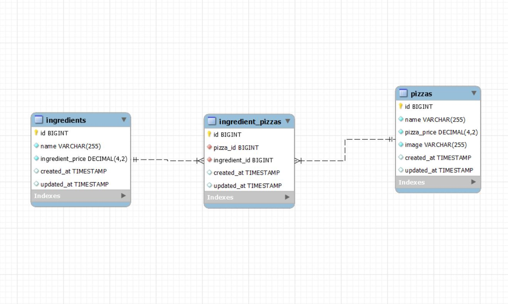

# Pizza Web app test by Ramón Folguera🧑💻

  <summary>Summary 📝</summary>
  <ol>
    <li><a href="#stack">Stack</a></li>
    <li><a href="#ddbb-diagram">Diagram</a></li>
    <li><a href="#local-installation">Installation</a></li>
    <li><a href="#endpoints">Endpoints</a></li>
    <li><a href="#contacto">Contact</a></li>
  </ol>

As for the requirements I was given, I created this small catalog where you can select one pizza and add/remove ingredients. When the number of ingredients changes, the total price updates automatically, with the total of all its ingredients plus 50% of the total for the preparation.


## Stack
For the Web app test I decided to use PHP/LARAVEL for the backend and REACT with REDUX for the frontend.

I installed dependencies like axios and react-bootstrap.

#####Used technologies:
Backend:
<div align="center">

<a href="https://php.net/">
    
</a>
<a href="https://laravel.com/">
    
</a>
<a href="https://www.mysql.com/">
    
</a>

<a href="https://git-scm.com/">
    
</a>
<a href="https://www.docker.com/">
    
</a>
<a href=" https://www.postman.com/">
    
</a>

 </div>
Frontend:
 <div align="center">
<a href="https://www.reactjs.com/">
    
</a>
<a href="https://developer.mozilla.org/es/docs/Web/JavaScript">
    
</a>

<a href="https://developer.mozilla.org/es/docs/Web/CSS">
    
</a>
<a href="https://www.w3schools.com/html/">
    
</a>
<a href="https://react-bootstrap.github.io/">
    
</a>
<a href="https://git-scm.com/">
    
</a>
<a href="https://nodejs.org/es/">
    
</a>

<a href="https://img.shields.io/badge/npm-F54D50?style=for-the-badge&logo=npm.js&logoColor=white">
    
</a>
</div>

## DDBB diagram


## Local installation 
Backend

1. Clone the repository in a terminal in your computer:
` $ git clone https://github.com/RamonFolguera/MCO_test_pizza_app_Ramon_Folguera.git `
2. `$ code .` To open Visual Studio Code, if that is your coding editor.
3. `cd backend`. To move to my backend code.
4. ` $ composer install ` To install all dependencies needed.
5. Connect my repo with the database with .env file. You just have to rename the file .env.example to .env and change the configuration to match your Docker one.
6. ``` $ php artisan migrate ``` To execute migrations.
7. ``` $ php artisan db:seed ``` To execute seeders.
8. ``` $ php artisan migrate:fresh --seed ``` In case you need to drop data base and create, excute migrations and seeders again.
9. ``` $ php artisan serve ``` 
10. Ready to test the endpoints in Postman. Here you have my Collection in JSON format. Copy the json collection, click import in Postman, select Raw text, paste text and Continue.
<details>
<summary> 📝</summary>

{
	"info": {
		"_postman_id": "6c69802c-cf74-4778-b1f7-5c9ef57e05f7",
		"name": "Test_Pizza_app",
		"schema": "https://schema.getpostman.com/json/collection/v2.1.0/collection.json"
	},
	"item": [
		{
			"name": "GetAllPizzas",
			"protocolProfileBehavior": {
				"disabledSystemHeaders": {}
			},
			"request": {
				"method": "GET",
				"header": [
					{
						"key": "Accept",
						"value": "application/json",
						"type": "default",
						"disabled": true
					}
				],
				"url": {
					"raw": "http://127.0.0.1:8000/api/pizzas",
					"protocol": "http",
					"host": [
						"127",
						"0",
						"0",
						"1"
					],
					"port": "8000",
					"path": [
						"api",
						"pizzas"
					]
				}
			},
			"response": []
		},
		{
			"name": "GetAllIngredients",
			"request": {
				"method": "GET",
				"header": [],
				"url": {
					"raw": "http://127.0.0.1:8000/api/ingredients",
					"protocol": "http",
					"host": [
						"127",
						"0",
						"0",
						"1"
					],
					"port": "8000",
					"path": [
						"api",
						"ingredients"
					]
				}
			},
			"response": []
		},
		{
			"name": "AddIngredient",
			"request": {
				"method": "POST",
				"header": [],
				"body": {
					"mode": "raw",
					"raw": "{\r\n    \"ingredient_id\": 10\r\n}",
					"options": {
						"raw": {
							"language": "json"
						}
					}
				},
				"url": {
					"raw": "http://127.0.0.1:8000/api/add-ingredient/1",
					"protocol": "http",
					"host": [
						"127",
						"0",
						"0",
						"1"
					],
					"port": "8000",
					"path": [
						"api",
						"add-ingredient",
						"1"
					]
				}
			},
			"response": []
		},
		{
			"name": "DeleteIngredient",
			"request": {
				"method": "DELETE",
				"header": [],
				"body": {
					"mode": "raw",
					"raw": "{\r\n    \"ingredient_id\": 15\r\n}",
					"options": {
						"raw": {
							"language": "json"
						}
					}
				},
				"url": {
					"raw": "http://127.0.0.1:8000/api/remove-ingredient/1",
					"protocol": "http",
					"host": [
						"127",
						"0",
						"0",
						"1"
					],
					"port": "8000",
					"path": [
						"api",
						"remove-ingredient",
						"1"
					]
				}
			},
			"response": []
		},
		{
			"name": "GetIngredientsNotInPizza",
			"request": {
				"method": "GET",
				"header": []
			},
			"response": []
		},
		{
			"name": "GetIngredient_pizzaByPizzaId",
			"request": {
				"method": "GET",
				"header": [],
				"url": {
					"raw": "http://127.0.0.1:8000/api/ingredient-pizzas/1",
					"protocol": "http",
					"host": [
						"127",
						"0",
						"0",
						"1"
					],
					"port": "8000",
					"path": [
						"api",
						"ingredient-pizzas",
						"1"
					]
				}
			},
			"response": []
		}
	]
}
</details>

## Local installation Frontend 
1. Move to my frontend folder.   ` $ cd frontend `
2. Install all dependencies with: ` $ npm install `
3. Run the server with:``` $ npm run dev ```

## Endpoints
<details>
<summary>Endpoints</summary>

 - GET ALL PIZZAS

            GET http://127.0.0.1:8000/api/pizzas

 - GET ALL INGREDIENTS

            GET http://127.0.0.1:8000/api/ingredients

- ADD INGREDIENT
        
        Adding id from the selected pizza by params (/id).

            POST http://127.0.0.1:8000/api/add-ingredient/1

              body:
        ``` js
            {
                "ingredient_id": 4
            }
        ```

- DELETE INGREDIENT
        
        Adding id from the selected pizza by params (/id).

            DELETE http://127.0.0.1:8000/api/remove-ingredient/1

              body:
        ``` js
            {
                "ingredient_id": 4
            }
        ```

- GET ALL INGREDIENTS THAT ARE NOT IN THE SELECTED PIZZA

         Adding id from the selected pizza by params (/id).

            GET http://127.0.0.1:8000/api/ingredients-not-in-pizza/1


- GET ALL INGREDIENT_PIZZAS RELATED TO SELECTED PIZZA

         Adding id from the selected pizza by params (/id).

            GET http://127.0.0.1:8000/api/ingredients-not-in-pizza/1

</details>

## Thanks:

I want to thank you for giving me the opportunity to showcase my skills learnt in the past months. I really enjoyed building this small app and I hope it is up to what standards you are looking for.

I will be more than happy to get any feedback from you. 

Project made by:

- **Ramón**
<a href="https://github.com/RamonFolguera" target="_blank"></a>

##Contacto
- **Ramón**
<a href = "mailto:folguera.ramon@gmail.com"></a>
<a href="https://www.linkedin.com/in/ram%C3%B3n-folguera-0ab32776/" target="_blank"></a> 
</p>
